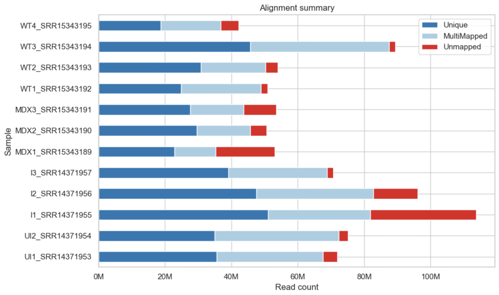
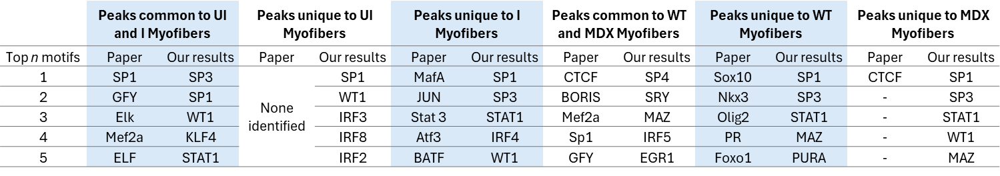

```{r setup, include=FALSE}
knitr::opts_chunk$set(echo = TRUE)
```

# Introduction

Myofibers are the main structural and functional units of skeletal muscle. They are highly adaptive cells that vary widely in size, metabolic activity, and functional properties. This adaptability is reflected in their transcriptomic and epigenomic landscapes, which can shift significantly in response to physiological and pathological conditions. Understanding these regulatory changes offers insights into how skeletal muscle adapts, regenerates, and deteriorates under different conditions.\
In this context, ATAC-seq data is a powerfool tool to study chromatin accessibility. When applied to single myofibers, this technique provides sufficient resolution and depth for downstream epigenetic analysis without the presence of confounding muscle resident cell types. This approach was conducted in the study "Application of ATAC-Seq for genome-wide analysis of the chromatin state at single myofiber resolution" by [@sahinyan2022atac]. In their work, they used single-myofiber ATAC-seq (smfATAC-seq) to profile chromatin accessibility in myofibers under various physiological and disease conditions.\
The aim of our project is to reproduce and critically evaluate key aspects of that study. We focus on two biologically relevant comparisons: uninjured (UI) vs. injured (I) myofibers, and wild-type (WT) vs. dystrophic (MDX) myofibers. The UI vs. I comparison allows us to explore how myofibers change their chromatin landscape during regeneration following cardiotoxin-induced injury. The WT vs. MDX comparison highlights the epigenomic consequences of Duchenne Muscular Dystrophy (DMD), for which the MDX mouse serves as a widely used model.\
Our pipeline covers the full pre-processing of raw ATAC-seq data, including quality control, alignment, filtering, peak calling, and normalization. We then assess data quality and consistency through correlation analysis, followed by differential accessibility analysis, gene set enrichment analysis and motif discovery to interpret the biological significance of the observed changes.

# Methods & Results

## Load packages

At first, all necessary packages were installed and loaded. Information on the package versions used can be found in the Appendix.

```{r load packages}
suppressPackageStartupMessages({
  library(GenomicRanges)
  library(rtracklayer)
  library(epiwraps)
  library(AnnotationHub)
  library(ensembldb)
  library(ggplot2)
  library(tidyverse)
  library(DESeq2)
  library(pheatmap)
  library(RColorBrewer)
  library(pheatmap)
  library(gridExtra)
  library(ggpubr)
  library(grid)
  library(limma)
  library(edgeR)
  library(MotifDb)
  library(universalmotif)
  library(data.table)
  library(TFBSTools)
  library(Biostrings)
  library(ggrepel)
  library(patchwork)
  library(yaml)
})
```

## The Data

The pipeline processes single myofiber ATAC-seq data obtained from the Extensor Digitorum Longus (EDL) muscle of *Mus musculus*. The raw data is available through the [SRA Run Selector](https://www.ncbi.nlm.nih.gov/Traces/study/?acc=PRJNA726576&o=acc_s%3Aa) and the authors also provide their processed coverage tracks on [GEO](https://www.ncbi.nlm.nih.gov/geo/query/acc.cgi?acc=GSE173676).

The dataset consists of two distinct and independently conducted experiments, each addressing a separate biological question. The first experiment investigates muscle regeneration by comparing uninjured and injured myofibers. The second focuses on muscular dystrophy by comparing wild-type (WT) and MDX mice, a model for Duchenne Muscular Dystrophy (DMD). These two experiments were performed on different days and used different mouse strains, both of which can introduce batch effects.

Because these batch effects are strongly confounded with the biological conditions (i.e., all WT and MDX samples belong to one batch, and all injured and uninjured samples to another), a joint analysis across all four conditions would not allow us to confidently separate technical variation from true biological differences. To avoid this confounding and ensure meaningful interpretation, we analyzed the two experiments separately.

**Experiment 1 – Muscle Regeneration (2021-05-01)**\
*Mouse strain: C57BL/6*

-   Uninjured_1–2: 2 uninjured control myofibers

-   Injured_1–3: 3 injured myofibers (collected 7 days after acute injury, representing the regenerating state)

**Experiment 2 – Muscular Dystrophy (2021-08-07)**\
*Mouse strain: C57/B10ScSn-Dmdmdx & C57/B10ScSn*

-   MDX_1–3: 3 myofibers from MDX mice (a DMD model with chronic muscle degeneration)

-   WT_1–4: 4 myofibers from wild-type healthy control mice

## Preprocessing

In order to generate all the data needed downstream (peaks, counts, coverage tracks), we processed the raw data. Since preprocessing is quite computationally and memory intensive, we performed it on Euler. All code scripts and resulting data are available in the `preprocessing` folder. The coverage tracks were too large for GitHub, so we uploaded them to [OneDrive](https://1drv.ms/f/c/ad47ab1cb526b6da/EiGJACKkCqhAqehU3_HI-AMBXvwKSJhkNprIwYIos2Fupg?e=tbCstp). If you want to rerun the R script, please download the coverage tracks and place them in `preprocessing`\>`results`\>`tracks`.

### 1. Trimming

Raw `.sra` files were converted to `.fastq.gz`, followed by adapter trimming using the `trimmomatic` package. Specifically, Illumina NexteraPE-PE adapters were removed. Quality control was performed both before and after trimming using `FastQC` and summarized with `MultiQC`.

### 2. Alignment

Trimmed reads were aligned to the mm10 mouse genome using `bowtie2`, followed by filtering, sorting, and indexing with `samtools`. Only uniquely mapping reads were retained. The `.bam` files were then filtered for high-quality, uniquely mapped reads (MAPQ ≥ 20), and PCR duplicates were marked using `Picard`. Read groups were added to comply with downstream processing tools. Final sorting and indexing was performed with `samtools`.

```{r, echo=FALSE, out.width="80%", fig.align='center'}

```

*Fig. 1: The horizontal bar plot shows the number of reads that mapped uniquely, mapped to multiple locations, or did not map at all for each sample.*

Many reads map to multiple genomic regions, which reduces the number of uniquely aligned reads retained for downstream analysis. As a result, the average unique mapping rate of around 50% is quite low.

### 3. Peak calling

Peaks were called using `MACS3` on each individual `.bam` file, generating `.narrowPeak` files representing regions of open chromatin.

### 4. Count Matrix Generation

To compare chromatin accessibility between conditions, we first combined the peak files from all replicates of each experiment (UI vs. I and WT vs. MDX). We then merged overlapping peaks to create a consensus peak set for each comparison. These consensus peaks represent regions that were accessible in at least one of the samples. Next, we counted how many reads from each sample overlapped with each consensus peak to create a count matrix.

### 6. Coverage Track Generation

For visualization and downstream analyses, normalized bigWig coverage tracks were generated using `bamCoverage` from the `deepTools` suite.

### 7. Condition Specific Peak Calling

To define reproducible peaks for each condtion, we used ENCODE's "naive overlap" approach [@ATACseqDataStandards]. First, we merged the aligned reads from all replicates per condition and called peaks on the pooled data. We then retained only those pooled peaks that overlapped by ≥50 % of their length with peaks from replicates. This filtering step ensures that downstream motif enrichment is based on robust, reproducible peak regions.

### 8. Load the Preprocessed Data

For the subsequent analysis, we load the merged coverage tracks and count matrices from both experiments into this R Markdown document.

```{r load data}
# Change the ouput size to look nicer
options(width = 150)

# Define folder structure
tracks_path <-"preprocessing/results/tracks"
mat_path <-"preprocessing/results/count_matrix"

# Load the merged coverage tracks for all experimental conditions
tracks <- list(
  Uninjured=paste0(tracks_path, "/uninjured_merged.bw"),
  Injured=paste0(tracks_path, "/injured_merged.bw"),
  WT=paste0(tracks_path, "/wt_merged.bw"),
  MDX=paste0(tracks_path, "/mdx_merged.bw")
)

# Define the sample names
names1 <- c("Uninjured_1", "Uninjured_2", "Injured_1", "Injured_2", "Injured_3")
names2 <- c("MDX_1", "MDX_2", "MDX_3", "WT_1", "WT_2", "WT_3", "WT_4")

# Read in the data table, skipping the first comment lines
counts1 <- read.delim(paste0(mat_path, "/counts_UI_I.txt"), comment.char="#", stringsAsFactors=FALSE)
counts2 <- read.delim(paste0(mat_path, "/counts_MDX_WT.txt"), comment.char="#", stringsAsFactors=FALSE)

# Rename the columns
colnames(counts1)[7:ncol(counts1)] <- names1
colnames(counts2)[7:ncol(counts2)] <- names2

# Set rownames to peak ID
rownames(counts1) <- counts1$Geneid
counts1$Geneid <- NULL
rownames(counts2) <- counts2$Geneid
counts2$Geneid <- NULL


# Look at the data
#cat("First few rows of the count matrix for uninjured vs. injured samples:\n")
#head(counts1)
#cat("First few rows of the count matrix for MDX vs. WT samples:\n")
#head(counts2)
```

## Data Validation

We plotted the enrichment of ATAC-seq signal around transcription start sites (TSSs) to assess data quality and validate that our assay accurately captured regions of open chromatin. Since TSSs are typically located in accessible, nucleosome-depleted regions of active genes, we expected to observe strong signal enrichment at these sites.

```{r TSS enrichment, fig.align='center'}
# 1. Load the Ensembl Transcript Database for mouse
ah <- AnnotationHub()

# 2. Search for relevant datasets
# Note: GRCm38 is the same genome assembly as mm10 used for alignment
# We use the Ensembl annotation, even though our reference genome is from UCSC, because we want to filter by biotype
q <- AnnotationHub::query(ah, c("Mus musculus", "EnsDb", "GRCm38"))

# 3. Retrieve metadata for all available versions
meta <- mcols(q)[, c("rdatadateadded", "title", "genome", "tags", "rdatapath")]

# 4. Select the newest version
ensdb <- ah[["AH83247"]]

# 5. Load transcripts (protein-coding only)
txs <- transcripts(ensdb, filter = TxBiotypeFilter("protein_coding"))

# 6. Fix chromosome naming by adding 'chr' prefix where appropriate
seqlevels(txs) <- ifelse(seqlevels(txs) %in% c(as.character(1:19), "X", "Y", "MT"),
                        paste0("chr", seqlevels(txs)),
                        seqlevels(txs))

# 7. Keep only chromosomes shared between annotation and BigWig files
bw_seqinfo <- seqinfo(BigWigFile(tracks[[1]]))
common_seqlevels <- intersect(seqlevels(txs), seqlevels(bw_seqinfo))
txs <- keepSeqlevels(txs, common_seqlevels, pruning.mode = "coarse")

# 8. Get transcription start site (TSS) positions
tss <- GenomicRanges::reduce(promoters(txs, upstream = 0, downstream = 1))

# 9. Compute signal matrix around TSS
tss_matrix <- epiwraps::signal2Matrix(tracks, granges(tss), w = 10, extend = 1000)
title <- " Enrichment at Transcription Start Site (TSS)"

# 10. Plot heatmap of the enrichment signals
hm <- epiwraps::plotEnrichedHeatmaps(tss_matrix, trim = 0.95, colors = c("white", "darkred"), 
                                    multiScale = TRUE, axis_name = "TSS")
draw(hm, column_title = title)
```

*Fig. 2: Heatmap showing the ATAC-seq signal around the transcription start sites (TSS) of uninjured, injured, WT, and MDX myofibers.*

The heatmap shows a clear enrichment of ATAC-seq signal at transcription start sites, indicating that chromatin accessibility is highest near gene promoters. This pattern confirms the expected biological behavior, where regulatory elements around the TSS are more open and accessible for transcription machinery binding. The slight upstream shift of the peaks suggests that many transcription factors preferentially bind just before the TSS.

## Replicate Comparison and Clustering

### Normalization

The raw count data was then normalized using the regularized log (rlog) transformation from the DESeq2 package, which stabilizes variance across samples, especially for genes with low counts.

```{r normalization}
# Function to normalize count data using rlog transformation from DESeq2
process_mat <- function(mat) {
  # Extract count columns starting from the 6th column onward (rest is meta data)
  count_data <- mat[, 6:ncol(mat)]
  
  # Convert count data to a numeric matrix
  count_data <- as.matrix(count_data)
  mode(count_data) <- "numeric"
  
  # Construct a DESeq2 dataset object without any experimental design
  dds <- DESeqDataSetFromMatrix(
    countData = count_data,
    colData = DataFrame(row.names = colnames(count_data)),
    design = ~1  # No experimental grouping; used for transformation only
  )
  
  # Apply rlog transformation (variance-stabilizing, blind to design)
  rlog_counts <- rlog(dds, blind = TRUE)
  
  # Extract the transformed (normalized) count matrix
  norm_mat <- assay(rlog_counts)
  
  # Replace any NA values with 0
  norm_mat[is.na(norm_mat)] <- 0
  
  return(norm_mat)
}

# Normalize counts for the "Uninjured vs. Injured" experiment
norm_counts1 <- process_mat(counts1)
#cat("First few rows of the normalized count matrix for uninjured vs. injured samples:\n")
#head(norm_counts1)

# Normalize counts for the "MDX vs. WT" experiment
norm_counts2 <- process_mat(counts2)
#cat("First few rows of the normalized count matrix for MDX vs. WT samples:\n")
#head(norm_counts2)
```

### Pearson correlation heatmaps

Pearson correlation heatmaps were generated from the normalized count data to evaluate the similarity between replicates within each experimental condition.

```{r correlation heatmap, fig.align='center'}
# PEARSON CORRELATION HEATMAPS

# Compute Pearson correlation matrices for normalized counts
cor_mat1 <- cor(norm_counts1, method = "pearson")
cor_mat2 <- cor(norm_counts2, method = "pearson")

# Define cell size for consistent heatmap appearance
cell_size <- 24

# Generate heatmap for the Uninjured vs. Injured comparison
hm1 <- pheatmap(
  cor_mat1,
  cluster_rows = FALSE,
  cluster_cols = FALSE,
  main = "Uninjured vs. Injured",
  col = colorRampPalette(brewer.pal(9, "Blues"))(100),
  silent = TRUE,
  cellwidth = cell_size,
  cellheight = cell_size
)

# Generate heatmap for the MDX vs. WT comparison
hm2 <- pheatmap(
  cor_mat2,
  cluster_rows = FALSE,
  cluster_cols = FALSE,
  main = "MDX vs. WT",
  col = colorRampPalette(brewer.pal(9, "Blues"))(100),
  silent = TRUE,
  cellwidth = cell_size,
  cellheight = cell_size
)

# Arrange both heatmaps side by side in a single figure
grid.arrange(
  grobs = list(hm1$gtable, hm2$gtable),
  ncol = 2,
  widths = c(1, 1),
  top = textGrob("Pearson correlation between replicates", gp = gpar(fontsize = 16, fontface = "bold"))
)

```

*Fig. 3: Heatmaps of Pearson correlation coefficients based on normalized ATAC-seq counts, illustrating the correlation between replicates in the Uninjured vs. Injured comparison (left) and the WT vs. MDX comparison (right).*

Overall, the Pearson correlation is very high for all samples, with correlation coefficients consistently above 0.95 regardless of condition. In the Uninjured vs. Injured experiment, the injured replicates clearly cluster more closely together than with the uninjured ones. However, the uninjured replicates appear more similar to the injured samples than to the other uninjured replicate. For the MDX vs. WT experiment, there is no clear difference in correlation between replicates of the same condition compared to samples from the other condition.

### Principal Component Analysis (PCA)

Next, we performed a Principal Component Analysis to visualize how close the samples cluster together.

```{r pca, fig.width=10, fig.height=5, fig.align='center'}
# PCA

# Function to extract condition based on the sample name
get_conditions <- function(colnames_vec) {
  substr(colnames_vec, 1, nchar(colnames_vec) - 2)
}

# Function to generate PCA plot
plot_pca <- function(norm_signal, subtitle_text) {
  sample_names <- colnames(norm_signal)
  sample_conditions <- get_conditions(sample_names)
  
  # Perform PCA on transposed data (samples as rows)
  pca <- prcomp(t(norm_signal), scale. = FALSE)
  
  # Calculate percentage of variance explained by PC1 and PC2
  var_explained <- round((pca$sdev^2 / sum(pca$sdev^2))[1:2] * 100, 1)
  
  # Create data frame for ggplot input
  pca_df <- data.frame(
    PC1 = pca$x[,1],
    PC2 = pca$x[,2],
    Sample = sample_names,
    Condition = sample_conditions
  )
  
  # Create PCA scatter plot with labels and styling
  ggplot(pca_df, aes(PC1, PC2, color = Condition, label = Sample)) +
    geom_point(size = 4) +                           
    geom_text(vjust = -1, hjust = 0.5, size = 5) +  
    coord_cartesian(clip = "off") +                
    theme_minimal(base_size = 20) +                 
    labs(
      x = paste0("PC1 (", var_explained[1], "% variance)"),
      y = paste0("PC2 (", var_explained[2], "% variance)"),
      subtitle = subtitle_text                      
    ) +
    theme(
      plot.subtitle = element_text(size = 20, hjust = 0.5, face = "bold"),
      legend.position = "bottom",
      legend.text = element_text(size = 14),
      legend.title = element_text(size = 16),
      legend.key.size = unit(0.6, "cm"),
      axis.title = element_text(size = 18),
      axis.text = element_text(size = 14),
      plot.margin = margin(10, 10, 10, 10)           
    )
}

# Generate individual PCA plots for both datasets
pca_plot1 <- plot_pca(norm_counts1, "Uninjured vs. Injured")
pca_plot2 <- plot_pca(norm_counts2, "MDX vs. WT")

# Combine the two plots side-by-side 
final_plot <- ggarrange(
  pca_plot1, pca_plot2,
  ncol = 2, nrow = 1,
  common.legend = FALSE
)

# Add an overall title above the combined figure
annotate_figure(
  final_plot,
  top = text_grob("PCA of Samples", face = "bold", size = 24, hjust = 0.5)
)

```

*Fig. 4: Principal component analysis (PCA) plot showing samples along the first two principal components for Uninjured vs. Injured (left) and MDX vs. WT (right).*

In the PCA plots, samples clearly separate based on their experimental conditions, indicating distinct chromatin accessibility profiles.

### Hierarchical Clustering between replicates

```{r hierarchical clustering, fig.width=8, fig.height=4,  fig.align='center'}
# HIERARCHICAL CLUSTERING

# Function to perform hierarchical clustering and plot dendrogram 
plot_hclust <- function(norm_signal, plot_title) {
  # Calculate distance matrix between samples (columns)
  dist_mat <- dist(t(norm_signal))
  
  # Perform hierarchical clustering on the distance matrix
  hc <- hclust(dist_mat)
  
  # Plot the dendrogram
  plot(hc, main = plot_title, xlab = "", sub = "", cex = 0.8, font.main = 1) 
}

# Set up plotting area to have 1 row and 2 columns for side-by-side plots
# Adjust outer margins (oma) to provide space for the overall title above both plots
# Adjust inner margins (mar) to fit axis labels and titles nicely
par(mfrow = c(1, 2), oma = c(1, 1, 2.2, 1), mar = c(4, 4, 1, 1))

# Generate hierarchical clustering dendrograms for both datasets
hc1 <- plot_hclust(norm_counts1, "Uninjured vs. Injured")
hc2 <- plot_hclust(norm_counts2, "MDX vs. WT")

# Add a main title above the two plots
mtext("Hierarchical Clustering of Samples", side = 3, outer = TRUE, line = 1, cex = 1.5)

# Reset plotting parameters to default (single plot, no outer margin adjustments)
par(mfrow = c(1, 1), oma = c(0, 0, 0, 0))

```

*Fig. 5: Hierarchical clustering dendrograms of normalized ATAC-seq counts showing sample relationships for Uninjured vs. Injured (left) and MDX vs. WT (right) conditions.*

As noted in the Pearson Correlation Heatmaps, the injured replicates cluster tightly together, while the uninjured replicates do not cluster as closely with each other and instead appear closer to the injured samples. In the MDX vs. WT comparison, replicates do not consistently cluster together by condition.

## Differential accessibility analysis

```{r differential accessibility analysis, warning=FALSE, fig.align='center'}
# Function to run the differential accessibility analysis
run_deseq2 <- function(count_mat, baseline_condition, contrast_condition, name = "") {
  # 1. Convert to numeric matrix
  count_data <- as.matrix(count_mat)
  mode(count_data) <- "numeric"
  
  # 2. Extract condition from column names (e.g., "WT_1", "WT_2")
  condition <- substr(colnames(count_data), 1, nchar(colnames(count_data)) - 2)
  
  # 3. Set up condition factor and relevel
  condition <- factor(condition)
  condition <- relevel(condition, ref = baseline_condition)
  
  # 4. Create metadata
  metadata <- data.frame(row.names = colnames(count_data), condition = condition)
  
  # 5. Create DESeqDataSet
  dds <- DESeqDataSetFromMatrix(countData = count_data,
                                colData = metadata,
                                design = ~ condition)
  
  # 6. Filter lowly accessible peaks
  dds <- dds[rowSums(counts(dds)) >= 1, ]
  
  # 7. Run DESeq2
  dds <- DESeq(dds)
  
  # 8. Extract results for contrast
  res <- results(dds, contrast = c("condition", contrast_condition, baseline_condition))
  res_df <- as.data.frame(res)
  res_df$peak <- rownames(res_df)
  res_df$logFC <- res$log2FoldChange
  res_df$pvalue <- res$pvalue
  res_df$method <- name
  
  # 9. Remove rows with missing values
  res_df <- na.omit(res_df)
  
  # 10. Adjust p-values and clip them
  res_df$padj <- p.adjust(res_df$pvalue, method = "BH")
  
  # Clip p-value of one particularly high outlier to reduce visual distortion
  res_df$padj <- ifelse(res_df$padj < 1e-10, 1e-10, res_df$padj)
  
  # 11. Mark significant genes
  res_df$significant <- ifelse(abs(res_df$logFC) > 1 & res_df$padj < 0.05, "Significant", "Not Significant")
  
  return(res_df)
}

# Experiment 1 - Uninjured vs. Injured: baseline = "Uninjured"
res1 <- run_deseq2(counts1[, 6:ncol(counts1)], baseline_condition = "Uninjured", contrast_condition = "Injured", name = "Uninjured vs. Injured")

# Experiment 2 - WT vs. MDX: baseline = "WT"
res2 <- run_deseq2(counts2[, 6:ncol(counts2)], baseline_condition = "WT", contrast_condition = "MDX", name = "WT vs. MDX")


# Function to annotate the peaks (distance to nearest gene)
# We are using the Ensembl annotation because it directly provides gene names and biotypes. However, we reformat it to match UCSC-style chromosome names. Two genes are on unknown chromosomes and do not match; we set their annotations to NA.
annotate <- function(counts) {
  # Get all protein-coding genes as GRanges 
  genes_gr <- genes(ensdb, filter = TxBiotypeFilter("protein_coding"))
  
  # Convert counts peaks to GRanges
  peak_gr <- GRanges(
    seqnames = counts$Chr,
    ranges = IRanges(start = counts$Start, end = counts$End),
    strand = "*"
  )
  
  # Use UCSC style for genes to match counts ("1" --> "chr1")
  seqlevelsStyle(genes_gr) <- "UCSC"
  
  # Identify common chromosomes
  common_chrs <- intersect(seqlevels(peak_gr), seqlevels(genes_gr))
  
  # Keep only shared chromosomes and store their original indices
  keep_idx <- which(seqnames(peak_gr) %in% common_chrs)
  peak_gr_filtered <- peak_gr[keep_idx]
  genes_gr <- keepSeqlevels(genes_gr, common_chrs, pruning.mode = "coarse")
  
  # Find nearest gene indices for filtered peaks
  nearest_genes_idx <- nearest(peak_gr_filtered, genes_gr)
  nearest_genes <- genes_gr[nearest_genes_idx]
  distances <- distance(peak_gr_filtered, nearest_genes)
  
  gene_names <- mcols(nearest_genes)$gene_name
  gene_ids <- names(nearest_genes)
  
  # Initialize annotation vectors with NA for all original peaks
  nearest_gene_vec <- rep(NA_character_, length(peak_gr))
  gene_id_vec <- rep(NA_character_, length(peak_gr))
  distance_vec <- rep(NA_integer_, length(peak_gr))
  annotation_vec <- rep(NA_character_, length(peak_gr))
  
  # Fill in values only for kept peaks
  nearest_gene_vec[keep_idx] <- gene_names
  gene_id_vec[keep_idx] <- gene_ids
  distance_vec[keep_idx] <- distances
  
  # Create annotation string: gene name + signed distance in bp
  annotation_vec[keep_idx] <- ifelse(
    distances >= 0,
    paste0(gene_names, "+", distances, " bp"),
    paste0(gene_names, distances, " bp")  # distances already negative
  )
  
  # Add annotation columns back to counts data frame
  annotated_counts <- counts
  annotated_counts$nearest_gene <- nearest_gene_vec
  annotated_counts$gene_id <- gene_id_vec
  annotated_counts$distance_to_gene <- distance_vec
  annotated_counts$annotation <- annotation_vec
  annotated_counts$peak <- rownames(counts)
  
  return(annotated_counts)
}
# Get significant peak IDs
significant_peaks1 <- rownames(res1[res1$significant == "Significant", ])
significant_peaks2 <- rownames(res2[res2$significant == "Significant", ])

# Print summary message
cat("DESeq2 identified", length(significant_peaks1), "significantly differentially accessible regions (FDR < 0.05 and |LFC| ≥ 1) between uninjured and injured myofibers, and", length(significant_peaks2), "significantly differentially accessible regions between WT and MDX.\n")

# Subset count matrix based on significant peaks (has information on the peaks)
counts1_sig <- counts1[rownames(counts1) %in% significant_peaks1, ]
counts2_sig <- counts2[rownames(counts2) %in% significant_peaks2, ]

# Annotate the count matrix
counts1_sig <- annotate(counts1_sig)
#print(head(counts1_sig))
counts2_sig <- annotate(counts2_sig)
#print(head(counts1_sig))

# Subset results based on significant peaks
res1_sig <- res1[rownames(res1) %in% significant_peaks1, ]
res2_sig <- res2[rownames(res2) %in% significant_peaks2, ]

# Merge the annotations to the reults
res1_annot <- merge(res1_sig, counts1_sig[, c("peak", "nearest_gene", "gene_id", "distance_to_gene","annotation")], by = "peak", all.x = TRUE)
res2_annot <- merge(res2_sig, counts2_sig[, c("peak", "nearest_gene", "gene_id", "distance_to_gene","annotation")], by = "peak", all.x = TRUE)

# Combine the annotated significant results
combined_annot <- rbind(res1_annot, res2_annot)

# Select top 6 by significance (lowest padj) per method
top6_annotated <- combined_annot %>%
  filter(!is.na(padj)) %>%
  arrange(padj) %>%
  group_by(method) %>%
  slice_head(n = 6) %>%
  ungroup()

# Combine the all results
combined_res <- rbind(res1, res2)

# Create volcano plot with annotation labels
volcano_combined <- ggplot(combined_res, aes(x = logFC, y = -log10(padj))) +
  geom_point(aes(color = significant), alpha = 0.7, size = 1) +
  scale_color_manual(values = c("gray", "maroon")) +
  facet_wrap(~ method, ncol = 2) +
  theme_minimal() +
  labs(
    title = "Volcano Plots",
    x = "Log2 Fold Change",
    y = "-Log10 (FDR corrected p-value)"
  ) + 
  theme(
    plot.title = element_text(hjust = 0.5),
    strip.text = element_text(size = 12)
  ) +
  geom_text_repel(
    data = top6_annotated,
    aes(label = annotation),
    color = "maroon",
    size = 3,
    max.overlaps = Inf,          # show all selected labels
    box.padding = 0.5,           # more space around label
    point.padding = 0.8,         # more space around the point
    force = 2,                   # increase repulsion
    force_pull = 0.3,            # gentle pull back to point
    nudge_y = 0.2,
    segment.size = 0.3,
    segment.color = "gray",
    min.segment.length = 0.2,    # avoid short segments
    direction = "both",          # free movement
    seed = 42
  )

print(volcano_combined)
```

*Fig. 6: Volcano plots of differential chromatin accessibility between conditions for Uninjured vs. Injured (left) and WT vs. MDX (right). Points represent peaks colored by significance, with top significant peaks labeled by their nearest gene and distance to that gene.*

The volcano plot comparing Uninjured vs. Injured samples shows much larger log-fold changes, indicating stronger shifts in accessibility for individual regions. In contrast, the WT vs. MDX comparison reveals a higher number of significantly differentially accessible regions overall, despite generally smaller fold changes.

One gene, Rftn1, stood out in the WT vs. MDX comparison with extremely high upregulation and statistical significance. Its p-value was clipped in the plot to maintain visual clarity. Such genes, which exhibit both strong effect size and high significance, could be of interest for follow-up studies.

Interestingly, for the Uninjured vs. Injured comparison, the annotated differentially accessible regions in our volcano plot differ entirely from those highlighted in the paper, suggesting potential differences in methods.

## Gene set enrichment analysis

## Motif enrichment analysis

We performed motif enrichment analysis to identify top motifs that are enriched in peaks around the promoter regions. This was performed with the following steps:

1.  Motif preparation

    ```{r motif preparation}
    # 1. Pull only mouse HOCOMOCOv10, convert
    motifs <- MotifDb::query(MotifDb, c("Mmusculus", "HOCOMOCOv10"))
    motifs <- do.call(TFBSTools::PWMatrixList, setNames(
      universalmotif::convert_motifs(motifs, class="TFBSTools-PWMatrix"),
      mcols(motifs)$geneSymbol))

    # 2. Subset the motifs to only the high quality ones
    motifNames <- unique(names(motifs))
    motifs <- lapply(motifNames, function(motif){
      redundant_motifs <- motifs[names(motifs)==motif]
      ids <- unlist(lapply(redundant_motifs, function(m) m@ID))
      quality_rating <- unlist(tstrsplit(ids, split=".", keep=3, fixed=TRUE))
      motif <- redundant_motifs[[which(quality_rating==min(quality_rating))]]
      motif
    })

    # 3. Convert motifs into the required format
    names(motifs) <- motifNames
    motifs <- do.call(PWMatrixList, motifs)
    ```

2.  Define promoter regions

    The promoter regions were defined as ±5 kb around the TSS to keep it consistent with the paper.

    ```{r promoter regions}
    proms <- promoters(txs, upstream = 5000, downstream = 5000)
    proms <- keepStandardChromosomes(proms, pruning.mode = "coarse")
    ```

3.  Prepare peaks

    Next, we prepared the set of peaks that are common and unique between two conditions as defined here:

    +-------------------------------------------------+--------------------------------------+
    | Group 1 (Uninjured and injured Myofibers)       | Group 2 (WT and MDX Myofibers)       |
    +=================================================+======================================+
    | Peaks common to uninjured and injured Myofibers | Peaks common to WT and MDX Myofibers |
    +-------------------------------------------------+--------------------------------------+
    | Peaks unique to uninjured Myofibers             | Peaks unique to WT Myofibers         |
    +-------------------------------------------------+--------------------------------------+
    | Peaks unique to injured Myofibers               | Peaks unique to MDX Myofibers        |
    +-------------------------------------------------+--------------------------------------+

    *Table 1: Peak categories across myofiber conditions.*

    As the paper did not specify how 'common peaks' were defined, we considered peaks to be common if they overlapped by at least 1 bp, and used the intersection of overlapping regions to represent the shared binding sites. While merging nearby peaks could capture broader regions of regulatory activity, we chose this stricter approach for consistency with the fixed-size peaks used in the paper.

    Then, we filtered for peaks that overlap with the promoter regions.

    ```{r}
    ## Function to clean granges
    clean_seqlevels <- function(granges){
      granges <- keepSeqlevels(granges, common_seqlevels, pruning.mode = "coarse")
      return(granges)
    }

    ## List the files:
    peakfiles <- list.files("preprocessing/results/peaks", full.names = TRUE)
    peakfiles <- peakfiles[grepl("\\.narrowPeak$", peakfiles)]
    ## Give them meaningful names
    names(peakfiles) <- gsub("_[^_]+\\..*$","",basename(peakfiles))
    peaks <- lapply(peakfiles, FUN=rtracklayer::import, format="narrowPeak")
    peaks <- lapply(peaks, clean_seqlevels)

    ## Function to clean granges
    clean_seqlevels <- function(granges){
      granges <- keepSeqlevels(granges, common_seqlevels, pruning.mode = "coarse")
      return(granges)
    }

    ## Function to obtain common and unique peaks between two GRanges objects
    obtain_peaks <- function(cond1, cond2){
      # Find overlaps
      hits <- findOverlaps(cond1, cond2)
      
      # Common peaks: intersect overlapping regions
      common_cond1 <- cond1[(queryHits(hits))]
      common_cond2  <- cond2[(subjectHits(hits))]
      common_peaks <- pintersect(common_cond1, common_cond2) #since exact peak region used
      common_peaks <- clean_seqlevels(common_peaks)
      
      # Unique peaks for cond1 (non-overlapping)
      cond1_peaks <- cond1[-unique(queryHits(hits))]
      cond1_peaks <- clean_seqlevels(cond1_peaks)
      
      # Unique peaks for cond2 (non-overlapping)
      cond2_peaks <- cond2[-unique(subjectHits(hits))]
      cond2_peaks <- clean_seqlevels(cond2_peaks)
      
      # Return as named list
      return(list(common = common_peaks, peaks1 = cond1_peaks, peaks2 = cond2_peaks))
    }

    ## Function to obtain sequences of peaks that overlap with promoters (±5 kb around the TSS)
    overlap_proms <- function(peaks_orig){
      overlap_peaks <- peaks_orig[overlapsAny(peaks_orig, proms, type="within"),]
      seqlevels(overlap_peaks) <- sub("^chr", "", seqlevels(overlap_peaks))
      seqs <- memes::get_sequence(overlap_peaks, twobit)

      return(seqs)
    }
    ```

4.  Run motif enrichment analysis

    We performed motif enrichment using MEME’s AME tool [@mcleayMotifEnrichmentAnalysis2010a] with its defaults (i.e. `avg` scoring, one‑tailed Fisher’s test, and a shuffled background), rather than HOMER used in the original paper.

    ```{r}
    # 1. To obtain twobit name
    twobit_results <- AnnotationHub::query(ah, c("GRCm38", "twobit", "dna.primary_assembly"))

    # 2. Extract twobit files
    twobit <- ah[["AH88475"]]

    ## Function to obtain and save motifs
    obtain_motifs <- function(seqs, filename){
      res <- memes::runAme(seqs, database=convert_motifs(motifs), meme_path="/home/jesslyn/meme/bin")
      saveRDS(res, file=filename)
      return(res)
    }

    ## Function to run motif enrichment analysis
    motif_analysis_by_group <- function(cond1, cond2, filename_common, filename_cond1, filename_cond2){
      # Obtain common and unique peaks for the conditions
      peaks_results <- obtain_peaks(cond1, cond2)
      
      # Prepare the sequences
      common_seqs <- overlap_proms(peaks_results$common)
      cond1_seqs <- overlap_proms(peaks_results$peaks1)
      cond2_seqs <- overlap_proms(peaks_results$peaks2)
      
      # Motif enrichment analysis for each of the group
      ## Obtain motifs from final peaks (exact peak region)
      res_common <- obtain_motifs(common_seqs, filename_common)
      res_cond1 <- obtain_motifs(cond1_seqs, filename_cond1)
      res_cond2 <- obtain_motifs(cond2_seqs, filename_cond2)
    }

    motif_dir <- "motif_enrichment/motifs/"
    ```

    Due to difficulties installing MEME on Windows, the motif enrichment analysis chunk has been set to `eval = FALSE`. To rerun the analysis, set `eval = TRUE`.

    ```{r, eval=FALSE}
    motif_analysis_by_group(peaks$ui_final, peaks$i_final, paste0(motif_dir, "ui_i_motifs.rds"), paste0(motif_dir, "ui_motifs.rds"), paste0(motif_dir, "i_motifs.rds"))
    motif_analysis_by_group(peaks$mdx_final, peaks$wt_final, paste0(motif_dir, "mdx_wt_motifs.rds"), paste0(motif_dir, "mdx_motifs.rds"), paste0(motif_dir, "wt_motifs.rds"))
    ```

5.  Visualize top 5 enriched motifs for each set of peaks

    Similar to the paper, we filtered for enriched motifs within each set of peaks with a adjusted p-value less than 0.05 and ranked them based on increasing adjusted p-value.

    For brevity, only the ‘common’ peak comparisons are shown here. Motif logo plots for the unique uninjured, unique injured, unique WT, and unique MDX sets are available in Supplementary Fig. 1.

    ```{r, fig.width=14, fig.height=10, dpi=150, fig.align='center', fig.show='hold'}
    ## Function to visualize motifs
    motif_visualization <- function(file_name, plot_title, overlap_val=0.99){
      res <- readRDS(file_name)
      filtered_res <- res[res$adj.pvalue < 0.05, ]
      filtered_res<- filtered_res[order(filtered_res$adj.pvalue, decreasing = FALSE), ]
      universalmotif::view_motifs(motifs[filtered_res[1:5, ]$motif_id], 
                                  min.overlap = overlap_val, 
                                  RC.text = "", 
                                  names.pos="right") +
        ggtitle(plot_title) +
        ggplot2::theme(plot.title = element_text(hjust = 0.5))
    }

    p1 <- motif_visualization(paste0(motif_dir, "ui_i_motifs.rds"), "(a) Top 5 motifs enriched in peaks common to Uninjured\nand Injured Myofibers overlapping the promoters")

    p2 <- motif_visualization(paste0(motif_dir, "mdx_wt_motifs.rds"), "(b) Top 5 motifs enriched in peaks common to WT\nand MDX Myofibers overlapping the promoters")
    combined <- p1 + p2 + plot_layout(ncol = 2)
    combined
    ```

    *Fig. 7: Top 5 enriched motifs in ATAC-Seq peaks overlapping the promoter regions (±5 kb) and common to (a) Uninjured and Injured Myofibers, (b) WT and MDX Myofibers.*

    Unfortunately, our results differed from the original paper’s top five enriched motifs and did not show substantial differences in motif enrichment between the different sets of peaks. This discrepancy is likely due to methodological differences between MEME (AME) and HOMER, some of which are outlined below.

```{r, echo=FALSE, out.width="100%", fig.align='center'}


```

*Table 2: Comparison of the top 5 enriched motifs identified in the paper versus our analysis (UI = Uninjured, I = Injured)*

+--------------------------------------------------+--------------------------------------------------------------------------------------------------------------------------------------------------+----------------------------------------------------------------------------------------------------------------------------------------------------------------+---------------------------------------------------------------------------------------------------------------------------------------------------------------------------+
| Feature                                          | MEME (AME) [@mcleayMotifEnrichmentAnalysis2010a]                                                                                                 | HOMER (findMotifsGenome.pl) [@heinzSimpleCombinationsLineageDetermining2010]                                                                                   | Potential impact                                                                                                                                                          |
+==================================================+==================================================================================================================================================+================================================================================================================================================================+===========================================================================================================================================================================+
| Motif Databases                                  | User-defined: Here, HOCOMOCOv10 mouse from MotifDb.                                                                                              | Default: Uses a built-in motif library, which consists of a list of previously determined motifs from previous data.                                           | There could be motifs that are only present in one of the databases, which can lead to difference in the motifs that appear significantly enriched.                       |
+--------------------------------------------------+--------------------------------------------------------------------------------------------------------------------------------------------------+----------------------------------------------------------------------------------------------------------------------------------------------------------------+---------------------------------------------------------------------------------------------------------------------------------------------------------------------------+
| Scoring strategy of a single sequence to a motif | Default: Calculates average motif odds score of all positions in the sequence                                                                    | ZOOPS (zero or one occurrences per sequence): Each sequence can have a maximum of one motif hit if the highest scoring match exceeds the predefined threshold. | `avg` can over‑emphasize sequences with many weak matches, whereas ZOOPS strictly counts presence or absence, affecting motif ranking regardless of the statistical test. |
|                                                  |                                                                                                                                                  |                                                                                                                                                                |                                                                                                                                                                           |
|                                                  |                                                                                                                                                  |                                                                                                                                                                | For more comparable results between these methods, `totalhits` can be used as the scoring strategy in MEME.                                                               |
+--------------------------------------------------+--------------------------------------------------------------------------------------------------------------------------------------------------+----------------------------------------------------------------------------------------------------------------------------------------------------------------+---------------------------------------------------------------------------------------------------------------------------------------------------------------------------+
| Statistical testing                              | Default: one‑tailed Fisher’s exact test with partition maximization.                                                                             | Default: Binomial test                                                                                                                                         | The difference in statistical test can lead to different p-values and ranking of motifs.                                                                                  |
+--------------------------------------------------+--------------------------------------------------------------------------------------------------------------------------------------------------+----------------------------------------------------------------------------------------------------------------------------------------------------------------+---------------------------------------------------------------------------------------------------------------------------------------------------------------------------+
| Background model                                 | Default: Built from input sequences, using a 0th‑order Markov model of primary sequence nucleotide frequencies, with shuffling of input sequence | Default: Background regions calculated based on the GC/CpG% at regions near the TSS of genes (±5 kb) and split into size of the analyzed regions.              | Differences in background composition, such as GC% content, can greatly affect the enrichment p-values, leading to different top motifs.                                  |
+--------------------------------------------------+--------------------------------------------------------------------------------------------------------------------------------------------------+----------------------------------------------------------------------------------------------------------------------------------------------------------------+---------------------------------------------------------------------------------------------------------------------------------------------------------------------------+

*Table 3: Comparison of MEME (AME) and HOMER (findMotifsGenome.pl) features and their potential impact.*

Limitations:

1.  We used a naive‐overlap approach to define peaks for each condition, which yields the most robust and reproducible regions but may miss true binding sites that are variable across replicates. In future work, applying an Irreproducible Discovery Rate (IDR) framework could capture a more confident and reproducible set of peaks [@ATACseqDataStandards].
2.  By default, MEME’s AME tool does not correct for GC‐content bias when generating its background model. Since promoter regions (±5 kb of TSS) are inherently GC‐rich, this omission can inflate enrichment statistics for GC‐rich motifs [@heinzSimpleCombinationsLineageDetermining2010]. This is consistent with our results (Fig. 7 and Supplementary Fig. 1), where most identified motifs exhibit high GC content. To address this, future analyses should employ a custom, GC‐matched background when running AME.

# Discussion

# References

# Appendix

## Code for Generating Figure 2 (Main Text)

The following Python code was used to generate the alignment summary plot shown in the main body of the report.

```{python, eval=FALSE}
pip install pandas matplotlib seaborn

import pandas as pd
import matplotlib.pyplot as plt
import matplotlib.ticker as mticker
import seaborn as sns

df=pd.read_csv("preprocessing/results/alignment/bowtie_stats.csv", sep=';')

sns.set(style='whitegrid')
fig, ax = plt.subplots(figsize=(10, 6))

df.set_index('Sample')[['Unique', 'MultiMapped', 'Unmapped']].plot(
    kind='barh',
    stacked=True,
    color={'Unique':'#1f78b4', 'MultiMapped':'#a6cee3', 'Unmapped':'#e31a1c'},
    ax=ax
)

ax.xaxis.set_major_formatter(mticker.FuncFormatter(lambda x, pos: f'{int(x/1e6)}M'))

ax.set_xlabel('Read count')
ax.set_title('Alignment summary')
plt.tight_layout()
plt.show()
```

## Supplementary Fig. 1

```{r, fig.width=14, fig.height=20, dpi=150, fig.show='hold'}

p1 <- motif_visualization(paste0(motif_dir, "ui_motifs.rds"), plot_title="(a) Top 5 motifs enriched in peaks unique to\nUninjured Myofibers overlapping the promoters")
p2 <- motif_visualization(paste0(motif_dir, "i_motifs.rds"), plot_title="(b) Top 5 motifs enriched in peaks unique to\nInjured Myofibers overlapping the promoters")

p3 <- motif_visualization(paste0(motif_dir, "wt_motifs.rds"), plot_title="(c) Top 5 motifs enriched in peaks unique\nto WT Myofibers overlapping the promoters")
p4 <- motif_visualization(paste0(motif_dir, "mdx_motifs.rds"), plot_title="(d) Top 5 motifs enriched in peaks unique\nto MDX Myofibers overlapping the promoters")

combined <- (p1 + p2) / plot_spacer() / (p3 + p4) +  plot_layout(heights = c(1, 0.02, 1))
    combined
```

*Supplementary Figure 1: Top 5 enriched motifs in ATAC-Seq peaks overlapping the promoter regions (±5 kb) and unique to (a) Uninjured Myofibers, (b) Injured Myofibers, (c) WT Myofibers, (d) MDX Myofibers.*

## Session Information

```{r}
sessionInfo()
```

## Bash Packages
Packages used to run the following scripts: 1_trim.sh, 2_align.sh, 3_merge_bam.sh, 4_peak_calling.sh, 5_condition_peaks.sh, 7_matrix_gen.sh
```{r}
env <- yaml::read_yaml("preprocessing/bash_environment/main_bash.yml")
print(env)
```

Packages used to run the following script: 6_coverage.sh
```{r}
env <- yaml::read_yaml("preprocessing/bash_environment/coverage_bash.yml")
print(env)
```
```

