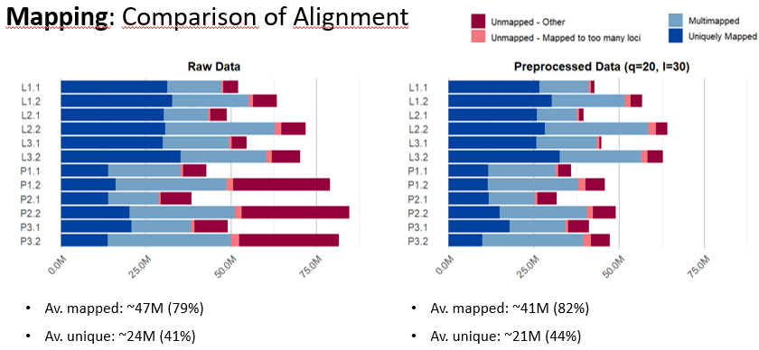

```{r setup, include=FALSE}
knitr::opts_chunk$set(echo = TRUE)
```

# Introduction

Myofibers are the main structural and functional units of skeletal muscle. They are highly adaptive cells that vary widely in size, metabolic activity, and functional properties. This adaptability is reflected in their transcriptomic and epigenomic landscapes, which can shift significantly in response to physiological and pathological conditions. Understanding these regulatory changes offers insights into how skeletal muscle adapts, regenerates, and deteriorates under different conditions.\
In this context, single-cell ATAC-seq has emerged as a powerful tool to study chromatin accessibility at the level of individual nuclei. When applied to isolated myonuclei, this technique provides sufficient resolution and depth for downstream epigenetic analysis. This approach was conducted in the study "Application of ATAC-Seq for genome-wide analysis of the chromatin state at single myofiber resolution" by [@sahinyan2022atac]. In their work, they used single-myofiber ATAC-seq (smfATAC-seq) to profile chromatin accessibility in myofibers under various physiological and disease conditions.\
The aim of our project is to reproduce and critically evaluate key aspects of that study. We focus on two biologically relevant comparisons: uninjured (UI) vs. injured (I) myofibers, and wild-type (WT) vs. dystrophic (MDX) myofibers. The UI vs. I comparison allows us to explore how myofibers change their chromatin landscape during regeneration following cardiotoxin-induced injury. The WT vs. MDX comparison highlights the epigenomic consequences of Duchenne Muscular Dystrophy (DMD), for which the MDX mouse serves as a widely used model.\
Our pipeline covers the full pre-processing of raw ATAC-seq data, including quality control, alignment, filtering, peak calling, and normalization. We then assess data quality and consistency through correlation analysis, followed by differential accessibility analysis, gene set enrichment analysis and motif discovery to interpret the biological significance of the observed changes.

# Methods & Results

## Load packages

At first, all necessary packages were installed and loaded. Information on the package versions used can be found in the Appendix.

```{r}
suppressPackageStartupMessages({
  library(GenomicRanges)
  library(rtracklayer)
  library(epiwraps)
  library(AnnotationHub)
  library(ensembldb)
  library(ggplot2)
  library(tidyverse)
  library(DESeq2)
  library(pheatmap)
  library(RColorBrewer)
  library(pheatmap)
  library(gridExtra)
  library(ggpubr)
  library(grid)
  library(limma)
  library(edgeR)
})
```

## The data

maybe explain here where data is from, what each category is, and 2 different batches –\> decided to do it as 2 seperat experiments

Experiment 1:

-   2 uninjured myofibers (UI1-2)

-   3 injured myofibers (samples taken 7 days after injury) (I1-3)

Experiment 2:

-   3 dystrophic (MDX) myofibers (mouse model for Duchenne muscular dystrophy) (MDX1-3)

-   4 wild-type (WT) myofibers (WT1-4)

## Preprocessing

Since preprocessing is quite computationally and memory intensive, we performed it on Euler. All code scripts and resulting data are available in the `preprocessing` folder. The coverage tracks were too large for GitHub, so we uploaded them to [Google Drive](https://drive.google.com/drive/folders/1OQhd_apUdG5OcCcjdzure0dNIePGcs8L?usp=sharing). If you want to rerun the R script, please download the coverage tracks and place them in `preprocessing`\>`results`\>`tracks`.

### 1. Trimming

maybe add pictures of the QC report?

### 2. Alignment

maybe add the statistic of how much mapping as a nice plot, something like this:



### 3. Peak calling

### 4. Count Matrix Generation

To compare chromatin accessibility between conditions, we first combined the peak files from all replicates of each experiment (uninjured vs. injured and WT vs. MDX). We then merged overlapping peaks to create a consensus peak set for each comparison. These consensus peaks represent regions that were accessible in at least one of the samples. Next, we counted how many reads from each sample overlapped with each consensus peak to create a count matrix.

### 5. Coverage Track Generation

### 6. Load the Preprocessed Data

For the subsequent analysis, we load the merged coverage tracks and count matrices from both experiments into this R Markdown document.

```{r load data}
# Change the ouput size to look nicer
options(width = 150)

# Define folder structure
tracks_path <-"preprocessing/results/tracks"
mat_path <-"preprocessing/results/count_matrix"

# Load the merged coverage tracks for all experimental conditions
tracks <- list(
  Uninjured=paste0(tracks_path, "/uninjured_merged.bw"),
  Injured=paste0(tracks_path, "/injured_merged.bw"),
  WT=paste0(tracks_path, "/wt_merged.bw"),
  MDX=paste0(tracks_path, "/mdx_merged.bw")
)

# Define the sample names
names1 <- c("Uninjured_1", "Uninjured_2", "Injured_1", "Injured_2", "Injured_3")
names2 <- c("MDX_1", "MDX_2", "MDX_3", "WT_1", "WT_2", "WT_3", "WT_4")

# Read in the data table, skipping the first comment lines
counts1 <- read.delim(paste0(mat_path, "/counts_UI_I.txt"), comment.char="#", stringsAsFactors=FALSE)
counts2 <- read.delim(paste0(mat_path, "/counts_MDX_WT.txt"), comment.char="#", stringsAsFactors=FALSE)

# Rename the columns
colnames(counts1)[7:ncol(counts1)] <- names1
colnames(counts2)[7:ncol(counts2)] <- names2

# Set rownames to peak ID
rownames(counts1) <- counts1$Geneid
counts1$Geneid <- NULL
rownames(counts2) <- counts2$Geneid
counts2$Geneid <- NULL


# Look at the data
#cat("First few rows of the count matrix for uninjured vs. injured samples:\n")
#head(counts1)
#cat("First few rows of the count matrix for MDX vs. WT samples:\n")
#head(counts2)
```

## Data Validation

We plotted the enrichment of ATAC-seq signal around transcription start sites (TSSs) to assess data quality and validate that our assay accurately captured regions of open chromatin. Since TSSs are typically located in accessible, nucleosome-depleted regions of active genes, we expected to observe strong signal enrichment at these sites.

```{r TSS enrichment}
# 1. Load the Ensembl Transcript Database for mouse
ah <- AnnotationHub()

# 2. Search for relevant datasets
# Note: GRCm38 is the same genome assembly as mm10 used for alignment
q <- query(ah, c("Mus musculus", "EnsDb", "GRCm38"))

# 3. Retrieve metadata for all available versions
meta <- mcols(q)[, c("rdatadateadded", "title", "genome", "tags", "rdatapath")]

# 4. Select the newest version
ensdb <- ah[["AH83247"]]

# 5. Load transcripts (protein-coding only)
txs <- transcripts(ensdb, filter = TxBiotypeFilter("protein_coding"))

# 6. Fix chromosome naming by adding 'chr' prefix where appropriate
seqlevels(txs) <- ifelse(seqlevels(txs) %in% c(as.character(1:19), "X", "Y", "MT"),
                        paste0("chr", seqlevels(txs)),
                        seqlevels(txs))

# 7. Keep only chromosomes shared between annotation and BigWig files
bw_seqinfo <- seqinfo(BigWigFile(tracks[[1]]))
common_seqlevels <- intersect(seqlevels(txs), seqlevels(bw_seqinfo))
txs <- keepSeqlevels(txs, common_seqlevels, pruning.mode = "coarse")

# 8. Get transcription start site (TSS) positions
tss <- GenomicRanges::reduce(promoters(txs, upstream = 0, downstream = 1))

# 9. Compute signal matrix around TSS
tss_matrix <- epiwraps::signal2Matrix(tracks, granges(tss), w = 10, extend = 1000)
title <- " Enrichment at transcription start site (TSS)"

# 10. Plot heatmap of the enrichment signals
hm <- epiwraps::plotEnrichedHeatmaps(tss_matrix, trim = 0.95, colors = c("white", "darkred"), 
                                    multiScale = TRUE, axis_name = "TSS")
draw(hm, column_title = title)
```

The heatmap shows a clear enrichment of ATAC-seq signal at transcription start sites (TSS), indicating that chromatin accessibility is highest near gene promoters. This pattern confirms the expected biological behavior, where regulatory elements around the TSS are more open and accessible for transcription machinery binding. The slight upstream shift of the peaks suggests that many transcription factors preferentially bind just before the TSS.

## Replicate Comparison and Clustering

### Normalization

The raw count data was then normalized using the regularized log (rlog) transformation from the DESeq2 package, which stabilizes variance across samples, especially for genes with low counts.

```{r normalization}
# Function to normalize count data using rlog transformation from DESeq2
process_mat <- function(mat) {
  # Extract count columns starting from the 6th column onward (rest is meta data)
  count_data <- mat[, 6:ncol(mat)]
  
  # Convert count data to a numeric matrix
  count_data <- as.matrix(count_data)
  mode(count_data) <- "numeric"
  
  # Construct a DESeq2 dataset object without any experimental design
  dds <- DESeqDataSetFromMatrix(
    countData = count_data,
    colData = DataFrame(row.names = colnames(count_data)),
    design = ~1  # No experimental grouping; used for transformation only
  )
  
  # Apply rlog transformation (variance-stabilizing, blind to design)
  rlog_counts <- rlog(dds, blind = TRUE)
  
  # Extract the transformed (normalized) count matrix
  norm_mat <- assay(rlog_counts)
  
  # Replace any NA values with 0
  norm_mat[is.na(norm_mat)] <- 0
  
  return(norm_mat)
}

# Normalize counts for the "Uninjured vs. Injured" experiment
norm_counts1 <- process_mat(counts1)
#cat("First few rows of the normalized count matrix for uninjured vs. injured samples:\n")
#head(norm_counts1)

# Normalize counts for the "MDX vs. WT" experiment
norm_counts2 <- process_mat(counts2)
#cat("First few rows of the normalized count matrix for MDX vs. WT samples:\n")
#head(norm_counts2)
```

### Pearson correlation heatmaps

Pearson correlation heatmaps were generated from the normalized count data to evaluate the similarity between replicates within each experimental condition.

```{r correlation heatmap}
# PEARSON CORRELATION HEATMAPS

# Compute Pearson correlation matrices for normalized counts
cor_mat1 <- cor(norm_counts1, method = "pearson")
cor_mat2 <- cor(norm_counts2, method = "pearson")

# Define cell size for consistent heatmap appearance
cell_size <- 24

# Generate heatmap for the Uninjured vs. Injured comparison
hm1 <- pheatmap(
  cor_mat1,
  cluster_rows = FALSE,
  cluster_cols = FALSE,
  main = "Uninjured vs. Injured",
  col = colorRampPalette(brewer.pal(9, "Blues"))(100),
  silent = TRUE,
  cellwidth = cell_size,
  cellheight = cell_size
)

# Generate heatmap for the MDX vs. WT comparison
hm2 <- pheatmap(
  cor_mat2,
  cluster_rows = FALSE,
  cluster_cols = FALSE,
  main = "MDX vs. WT",
  col = colorRampPalette(brewer.pal(9, "Blues"))(100),
  silent = TRUE,
  cellwidth = cell_size,
  cellheight = cell_size
)

# Arrange both heatmaps side by side in a single figure
grid.arrange(
  grobs = list(hm1$gtable, hm2$gtable),
  ncol = 2,
  widths = c(1, 1),
  top = textGrob("Pearson correlation between replicates", gp = gpar(fontsize = 16, fontface = "bold"))
)

```

Overall, the Pearson correlation is very high for all samples, with correlation coefficients consistently above 0.95 regardless of condition. In the Uninjured vs. Injured experiment, the injured replicates clearly cluster more closely together than with the uninjured ones. However, the uninjured replicates appear more similar to the injured samples than to the other uninjured replicate. For the MDX vs. WT experiment, there is no clear difference in correlation between replicates of the same condition compared to samples from the other condition.

### Principal Component Analysis (PCA)

Next, we performed a Principal Component Analysis to visualize how close the samples cluster together.

```{r pca, fig.width=10, fig.height=5}
# PCA

# Function to extract condition based on the sample name
get_conditions <- function(colnames_vec) {
  substr(colnames_vec, 1, nchar(colnames_vec) - 2)
}

# Function to generate PCA plot
plot_pca <- function(norm_signal, subtitle_text) {
  sample_names <- colnames(norm_signal)
  sample_conditions <- get_conditions(sample_names)
  
  # Perform PCA on transposed data (samples as rows)
  pca <- prcomp(t(norm_signal), scale. = FALSE)
  
  # Calculate percentage of variance explained by PC1 and PC2
  var_explained <- round((pca$sdev^2 / sum(pca$sdev^2))[1:2] * 100, 1)
  
  # Create data frame for ggplot input
  pca_df <- data.frame(
    PC1 = pca$x[,1],
    PC2 = pca$x[,2],
    Sample = sample_names,
    Condition = sample_conditions
  )
  
  # Create PCA scatter plot with labels and styling
  ggplot(pca_df, aes(PC1, PC2, color = Condition, label = Sample)) +
    geom_point(size = 4) +                           
    geom_text(vjust = -1, hjust = 0.5, size = 5) +  
    coord_cartesian(clip = "off") +                
    theme_minimal(base_size = 20) +                 
    labs(
      x = paste0("PC1 (", var_explained[1], "% variance)"),
      y = paste0("PC2 (", var_explained[2], "% variance)"),
      subtitle = subtitle_text                      
    ) +
    theme(
      plot.subtitle = element_text(size = 20, hjust = 0.5, face = "bold"),
      legend.position = "bottom",
      legend.text = element_text(size = 14),
      legend.title = element_text(size = 16),
      legend.key.size = unit(0.6, "cm"),
      axis.title = element_text(size = 18),
      axis.text = element_text(size = 14),
      plot.margin = margin(10, 10, 10, 10)           
    )
}

# Generate individual PCA plots for both datasets
pca_plot1 <- plot_pca(norm_counts1, "Uninjured vs. Injured")
pca_plot2 <- plot_pca(norm_counts2, "MDX vs. WT")

# Combine the two plots side-by-side 
final_plot <- ggarrange(
  pca_plot1, pca_plot2,
  ncol = 2, nrow = 1,
  common.legend = FALSE
)

# Add an overall title above the combined figure
annotate_figure(
  final_plot,
  top = text_grob("PCA of Samples", face = "bold", size = 24, hjust = 0.5)
)

```

In the PCA plots, samples clearly separate based on their experimental conditions, indicating distinct chromatin accessibility profiles.

### Hierarchical Clustering between replicates

```{r hierarchical clustering, fig.width=8, fig.height=4}
# HIERARCHICAL CLUSTERING

# Function to perform hierarchical clustering and plot dendrogram 
plot_hclust <- function(norm_signal, plot_title) {
  # Calculate distance matrix between samples (columns)
  dist_mat <- dist(t(norm_signal))
  
  # Perform hierarchical clustering on the distance matrix
  hc <- hclust(dist_mat)
  
  # Plot the dendrogram
  plot(hc, main = plot_title, xlab = "", sub = "", cex = 0.8, font.main = 1) 
}

# Set up plotting area to have 1 row and 2 columns for side-by-side plots
# Adjust outer margins (oma) to provide space for the overall title above both plots
# Adjust inner margins (mar) to fit axis labels and titles nicely
par(mfrow = c(1, 2), oma = c(1, 1, 4, 1), mar = c(4, 4, 2, 1))

# Generate hierarchical clustering dendrograms for both datasets
hc1 <- plot_hclust(norm_counts1, "Uninjured vs. Injured")
hc2 <- plot_hclust(norm_counts2, "MDX vs. WT")

# Add a main title above the two plots
mtext("Hierarchical Clustering of Samples", side = 3, outer = TRUE, line = 1, cex = 1.5)

# Reset plotting parameters to default (single plot, no outer margin adjustments)
par(mfrow = c(1, 1), oma = c(0, 0, 0, 0))

```

As noted in the Pearson Correlation Heatmaps, the injured replicates cluster tightly together, while the uninjured replicates do not cluster as closely with each other and instead appear closer to the injured samples. In the MDX vs. WT comparison, not all WT replicates cluster more closely together than with MDX samples, but overall, most replicates tend to group closer to their own condition than to the other.

## Differential accessibility analysis

```{r}
# Function to get the same results for all DE
process_and_plot_results <- function(res_df, res = NULL, method_name = "Method", 
                                     normalized_counts = NULL) {
  
  # Remove rows with missing values in results (e.g., NA p-values)
  res_df <- na.omit(res_df)
  
  # Adjust p-values and clip them
  res_df$padj <- p.adjust(res_df$pvalue, method = "bonferroni")
  # Clip p-values
  res_df$padj <- ifelse(res_df$padj < 1e-50, 1e-50, res_df$padj) 
  
  # Mark significant genes based on thresholds
  res_df$significant <- ifelse(abs(res_df$logFC) > 1 & 
                              res_df$padj < 0.05, "Significant", "Not Significant")
  
  
  # Visualize results
  # 1. MA Plot
  if (!is.null(res) & method_name != "limma"){
    plotMA(res, main = paste("MA Plot (", method_name, ")", sep = ""))
  } else if ((!is.null(res)) & (method_name == "limma")){
    limma::plotMA(res, main = paste("MA Plot (", method_name, ")", sep = ""))
  }
  
  # Create Volcano Plot
  volcano <- ggplot(res_df, aes(x = logFC, y = -log10(padj))) +
    geom_point(aes(color = significant), alpha = 0.7, size = 1) +
    scale_color_manual(values = c("gray", "maroon")) +
    theme_minimal() +
    labs(
      title = paste("Volcano Plot (", method_name, ")", sep = ""),
      x = "Log2 Fold Change",
      y = "-Log10 (Bonferroni corrected p-value)"
    )
  print(volcano)
  
  # Select top genes
  top_genes <- rownames(res_df[order(res_df$padj), ])[abs(res_df$logFC) > 2]
  top_genes <- top_genes[1:min(50, length(top_genes))]
  
  # Heatmap of top differentially expressed genes
  if (!is.null(normalized_counts)) {  # Check for normalized counts
    pheatmap(normalized_counts[top_genes, ], cluster_rows = TRUE, 
             cluster_cols = TRUE, 
             main = paste("Heatmap of Top Genes (", method_name, ")", sep = ""))
  }
  
  # Extract significant DEGs
  significant_genes <- rownames(res_df[res_df$significant == "Significant", ])
  return(significant_genes)
}
```

```{r}
run_limma_voom <- function(count_mat, baseline_condition) {
  # 1. Extract numeric count matrix
  count_data <- as.matrix(count_mat)
  mode(count_data) <- "numeric"
  
  # 2. Extract condition from column names (e.g., "WT_1", "WT_2")
  condition <- substr(colnames(count_data), 1, nchar(colnames(count_data)) - 2)
  condition <- factor(condition)
  condition <- relevel(condition, ref = baseline_condition)
  
  # 3. Create DGEList object
  dge <- DGEList(counts = count_data, group = condition)
  
  # 4. Filter out lowly expressed peaks
  keep <- filterByExpr(dge)
  dge <- dge[keep, , keep.lib.sizes = FALSE]
  
  # 5. Normalize using TMM
  dge <- calcNormFactors(dge)
  
  # 6. Create design matrix
  design <- model.matrix(~ condition)
  print("Design matrix head:")
  print(head(design))
  
  # 7. Voom transformation
  v <- voom(dge, design = design, plot = TRUE)
  
  # 8. Fit linear model
  fit <- lmFit(v, design)
  fit <- eBayes(fit)
  
  # 9. Extract results (condition effect = coef 2)
  results <- topTable(fit, coef = 2, number = Inf, sort.by = "P")
  results_df <- as.data.frame(results)
  results_df$gene <- rownames(results_df)
  results_df$pvalue <- results$P.Value
  
  # 10. Optionally process and visualize results
  limma_DEGs <- process_and_plot_results(results_df, res = fit, method_name = "limma", normalized_counts = v$E)
  
  # 11. Return results
  return(list(results = results_df, DEGs = limma_DEGs))
}
```

```{r}
run_deseq2 <- function(count_mat, baseline_condition, contrast_condition) {
  # 1. Convert to numeric matrix
  count_data <- as.matrix(count_mat)
  mode(count_data) <- "numeric"
  
  # 2. Extract condition from column names (e.g., "WT_1", "WT_2")
  condition <- substr(colnames(count_data), 1, nchar(colnames(count_data)) - 2)
  
  # 3. Set up condition factor and relevel
  condition <- factor(condition)
  condition <- relevel(condition, ref = baseline_condition)
  
  # 4. Create metadata
  metadata <- data.frame(row.names = colnames(count_data), condition = condition)
  
  # 5. Create DESeqDataSet
  dds <- DESeqDataSetFromMatrix(countData = count_data,
                                colData = metadata,
                                design = ~ condition)
  
  # 6. Filter lowly accessible peaks
  dds <- dds[rowSums(counts(dds)) >= 1, ]
  
  # 7. Run DESeq2
  dds <- DESeq(dds)
  
  # 8. Extract results for contrast
  res <- results(dds, contrast = c("condition", contrast_condition, baseline_condition))
  res_df <- as.data.frame(res)
  res_df$gene <- rownames(res_df)
  res_df$logFC <- res$log2FoldChange  # Rename for consistency
  res_df$pvalue <- res$pvalue
  normalized_counts <- assay(vst(dds, blind = FALSE))  # Variance stabilizing transformation
  
  # 9. Extract significant DEGs from DESeq2
  DESeq2_DEGs <- process_and_plot_results(res_df, res, method_name = "DESeq2", normalized_counts)
  
  # 10. Return results
  return(list(results = res_df, DEGs = DESeq2_DEGs))
}

```

### Uninjured vs. Injured Experiment

```{r}
# Now apply the function to your two datasets:

# Dataset 1: baseline = "Uninjured"
res1_limma <- run_limma_voom(counts1[, 6:ncol(counts1)], baseline_condition = "Uninjured")
res1_des <- run_deseq2(counts1[, 6:ncol(counts1)], baseline_condition = "Uninjured", contrast_condition = "Injured")


```

```{r}
# Dataset 2: baseline = "WT"
res2 <- run_limma_voom(counts2[, 6:ncol(counts2)], baseline_condition = "WT")
res2_des <- run_deseq2(counts2[, 6:ncol(counts2)], baseline_condition = "WT", contrast_condition = "MDX")
```

## Gene set enrichment analysis

## Motif enrichment analysis

# Discussion

# References

# Appendix

## Session Information

```{r}
sessionInfo()
```
